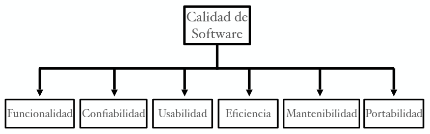

# Ingenieria del Software

## Capitulo 1: Introduccion

* **Software**: Coleccion de programas, procedimientos, y la documentacion y datos asociados que determinan la operacion de un sistema de computacion.

### Dominio del Problema

#### Software de nivel industrial

* La diferencia clave con el software pensado por un alumno y el de nivel industrial radica en la **Calidad**: incluyendo **Usabilidad**, **Confiabilidad**, **Portabilidad**, etc.

* La **Alta Calidad** requiere mucho testing, que consume entre el 30 y 50% del esfuerzo del desarrollo.

* Llamaremos **"Software"** solo al software de nivel industrial.

#### Demorado y poco Confiable

Las fallas del software son distintas de las fallas mecanicas o electricas:

* En software, en general, las fallas **NO** son consecuencias del uso y el deterioro.

* Las fallas ocurren como consecuencias de errores (o *bugs*) introducidos **Durante** el desarrollo.

* **La falla que causa el problema existe desde el comienzo**, solo que se manifiesta tarde.

#### Mantenimiento

Una vez entregado el software, requiere de mantenimiento. Pero ¿Para que es necesario el mantenimiento si el software no se deteriora con el uso? Es necesario el mantenimiento para corregir errores residuales (*Updates*). Durante la vida del software, el mantenimiento puede costar mas que el desarrollo.

Existen distintos tipos de mantenimientos:

* **Mantenimiento Correctivo**: Para mejorar funcionalmente el software (*Upgrades*) y adaptarlos a los cambios de entorno.

* **Mantenimientos Adaptativos**: Incluye la compresion del software existente (codigo y documentacion), compresion de los efectos del cambio, realizacion de los cambios (codigo y documentacion), testear lo nuevo y re-testear lo viejo.

### Desafios de la IS (Ingenieria del Software)

**Ingenieria del Software**: Aplicacion de un enfoque sistematico, disciplinado, y cuantificable al desarrollo, operacion, y mantenimiento del software.

* **Enfoque Sistematico**: Metodologia y practica existentes para solucionar un problema dentro de un dominio determinado. Esto permite repetir el proceso y da la posibilidad de predecirlo (independientemente del grupo de personas que lo lleve a cabo).

El problema de producir software para satisfacer las necesidades del cliente/usuario guia el enfoque usado en Ingeniria del Software. Pero hay otros factores que tienen impacto en la eleccion del enfoque: **Escala**, **Calidad**, **Productividad**, **Consistencia** y **Cambios**

#### Escala

La Ingenieria del Software debe considerar la escala del sistema a desarrollar. Los metodos utilizados para desarrollar pequeños problemas no siempre escalan a grandes problemas, estos metodos deben tener la capacidad de adaptacion y respuesta de un sistema con respecto al rendimiento del mismo a medida de que aumentan o disminuyen de forma significativa el numero de usuarios o requerimientos del mismo.
  Dos claras dimensiones a considerar:

* Metodos de Ingeniria.
* Administracion del proyecto.

#### Calidad

Desarrollar software de alta calidad es un objetivo fundamental. La calidad del software es dificil de definir.

* #### Calidad - Estandar ISO

    - **Funcionalidad**: Capacidad de proveer funciones que cumplen las necesidades establecidas o implicadas.
    - **Confiabilidad**: Capacidad de realizar las funciones requeridas bajo las condiciones establecidas durante un tiempo especifico.
    - **Usabilidad**: Capacidad  de ser comprendido, aprendido y usado.
    - **Eficiencia**: Capacidad de proveer desempeño apropiado relativo a la cantidad de recursos usados.
    - **Mantenibilidad**: Capacidad de ser modificado con el proposito de corregir, mejorar, o adaptar.
    - **Portabilidad**: Capacidad de ser adaptado a distintos entornos sin aplicar otras acciones que las provistas a este proposito en el producto.

* #### Calidad (*Amy J.Ko*)

    - Propiedades del codigo detras del sistema (*Boehm '76*):
        * **Correctitud**: Cuando un programa se comporta segun las especificaciones.
        * **Confiabilidad**: Cuando un programa se comporta de la misma manera a lo largo del tiempo en un mismo entorno operativo.
        * **Robutez**: La medida en que un programa puede recuperarse de errores o entradas inesperadas.
        * **Rendimiento**: La medida en que un programa utiliza los recursos informaticos de forma economica. El rendimiento esta directamente determinado por la cantidad de instrucciones que debe ejecutar un programa para realizar sus operaciones.
        * **Portabilidad**: El grado en que una implementacion puede ejecutarse en diferentes plataformas sin ser modificadas.
        * **Seguridad**: La medida en que solo las personas autorizadas pueden acceder a la informacion en un sistema de software.
        * **Interoperabilidad**: La medida en que un sistema puede interactuar sin problemas con otros sistemas, generalmente mediante el uso de estandares.
    - **Propiedades del codigo y de los desarrolladores** interactuando con el sistema:
        * **Verificabilidad**: El esfuerzo requerido para verificar que el software hace lo que esta destinado a hacer.
        * **Mantenibilidad**: La medida en que el software se puede corregir, adaptar o perfeccionar. Esto depende principalmente de cuan comprensible sea la implementacion de un programa.
        * **Reutilizacion**: La medida en que los componentes de un programa se pueden utilizar para fines no deseados.
        * **Seguridad**: La medida en que solo las personas autorizadas pueden acceder a la informacion en un sistema de software.
    - **Propiedades del diseño y experiencia del usuario** con un sistema de software:
        * ***Learnability***: La facilidad con la que una persona puede aprender a operar un programa.
        * **Eficiencia del Usuario**: La velocidad con la que una persona puede realizar tareas con un programa.
        * **Accesibilidad**: La diversidad de habilidades fisicas o cognitivas que pueden operar con exito el software.
        * **Utilidad**: La medida en que el software resuelve un problema.
        * **Privacidad**: La medida en que un sistema impide el acceso a informacion destinada a una audiencia o uso en particular.
        * **Coherencia**: La medida en que la funcionalidad relacionada en un sistema aprovecha las misma habilidades, en lugar de requerir nuevas habilidades para aprender a usarlas.
        * **Usabilidad**: Engloba todas las cualidades anteriores. Lo usamos para representar cualquier cualidad que afecte la capacidad de alguien para usar un sistema.
        * **Sesgo**: Las multiples formas en que el software puede discriminar, excluir o ampliar o reforzar las estructuras discriminatorias o excluyentes en la sociedad.

El concepto de "calidad" es especifico al proyecto: En algunos casos la confiabilidad es mas importante que la usabilidad. Para cada proyecto, el objetivo de calidad debe especificarse de antemano. La **Confiabilidad** es usualmente el principal criterio de calidad, mientras +fallas => -confiable va a ser el software

#### Productividad

La Ingenieria del Software esta motivida por el costo y el cronograma (*schedule*) (El cronograma es muy importante en el contexto de negocios). Tanto una solucion que **Demora Mucho Tiempo** como una que entrega un **Software Barato y de Baja Calidad** son **Inaceptables**. El **Costo del software** es principalmente el costo de la mano de obra, por lo que se mide en Persona/Mes (*PM*).
 La Productividad (en terminos de *KLOG/PM*) captura ambos conceptos, si es mas alta => menor costo y/o menor tiempo (tambien dependen de la cantidad de personas).

#### Consistencia y Repetitividad

Unos de los desafios claves en Ingenieria del Software es asegurar que el exito pueda repetirse, con el fin de mantener alguna consistencia en la calidad y la productividad. Un objetivo de la Ingenieria del Software es la **Sucesiva** produccion de sistemas de alta calidad y con alta productividad.
  La **consistencia** permite predecir el resultado del proyecto con certeza razonable. Sin consistencia sera dificil estimar costos.

#### Cambio

Las practicas de Ingenieria del Software deben preparar alsoftware para que este sea facilmente modificable. Los metodos que no permiten cambios, aun si producen alta calidad y productividad, son poco utiles.

### Enfoque de la Ingenieria del Software